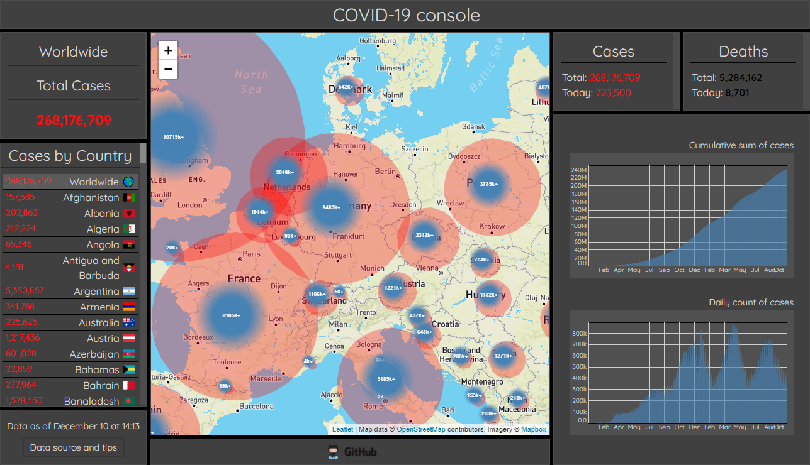

# COVID-19 Dashboard

Project-based course focusing on best practices (MVC pattern, Airbnb style, Conventional Commits, BEM) and group work, with weekly projects culminating in a Covid dashboard 

- Deployed at: https://llama-with-thumbs.github.io/covid/
  
- App-interface
  

Technologies:
- Model-View-Controller pattern
- map: mapbox https://docs.mapbox.com/api/overview/
- charts: D3.js https://d3js.org/
- Webpack module bundler https://webpack.github.io/

Aggregated data sources:
- Main:
  - COVID-19 Data Repository by the Center for Systems Science and Engineering (CSSE) at Johns Hopkins University https://github.com/CSSEGISandData/COVID-19
- Additional:
  - https://api.covid19api.com/
  - https://corona.lmao.ninja/v2/countries;

\* CPIA transparency, accountability, and corruption in the public sector rating (1=low to 6=high).

  Definition: Transparency, accountability, and corruption in the public sector assess the extent to which the executive can be held accountable for its use of funds and for the results of its actions by the electorate and by the legislature and judiciary, and the extent to which public employees within the executive are required to account for administrative decisions, use of resources, and results obtained. The three main dimensions assessed here are the accountability of the executive to oversight institutions and of public employees for their performance, access of civil society to information on public affairs, and state capture by narrow vested interests.

Source: World Bank Group, CPIA database (http://www.worldbank.org/ida).